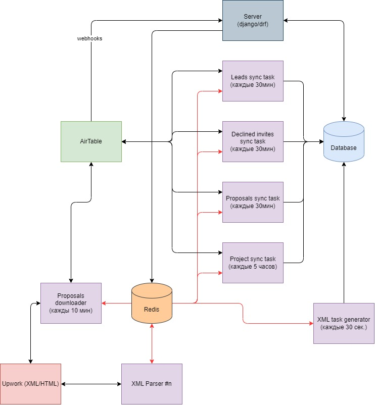

# Leadgen Management

Running requires:
* Python 3.11 (tested under Python 3.11)

> :warning: **Webhooks have not been tested!**


### Summary
```text
Project for scraping upwork and synchronization with AirTable
```
##### Synchronization Tables:
 
- Filters
- Projects
- Proposals
- Leads
- Declined Invites

##### Tables in which records are created, scraped and supplemented:

- Projects - scraped, created
- Proposals - scraped, supplemented


### Architecture



---

### Create environment file in /deploy/prod/.env (see .env-example)
> :warning: **Required!**
```text
    .
    ├── ...
    ├── Base dir
    │   ├── deploy
    │   │   ├── prod
    │   │   │   ├── docker-compose.yml
>>> │   │   │   └── .env
    │   │   └── ...
    │   ├── .env-example
    │   └── ...
    └── ...
```
---

### Docker 

```bash
cd deploy/prod/
```

Config
```bash
docker-compose config
```
Build
```bash
docker-compose up -d --build
```
View containers
```bash
docker-compose ps
```
Logs
```bash
docker-compose logs -f
```

--- 

###### At the first start, you need to call the update_upwork_tokens task

```shell 
>>>from upwork_auto_login.tasks import update_upwork_tokens
>>>update_upwork_tokens.delay()
```
---
